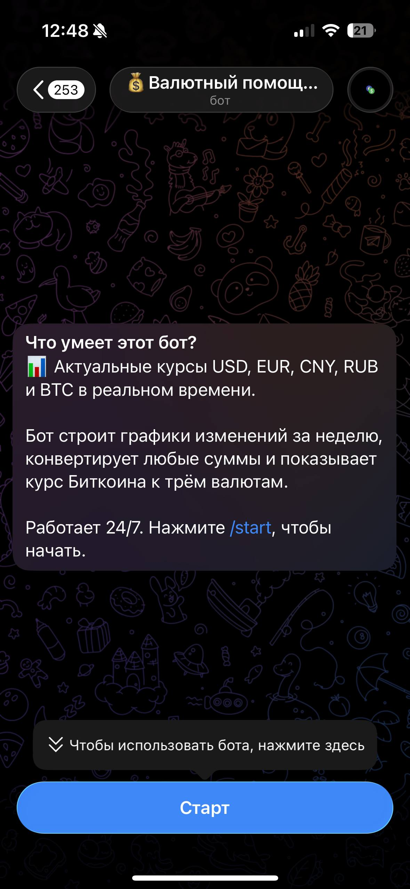
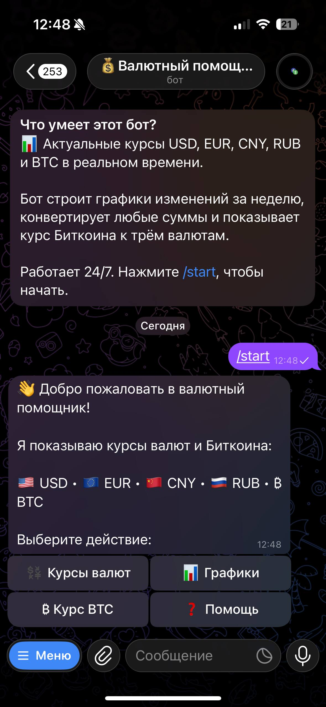
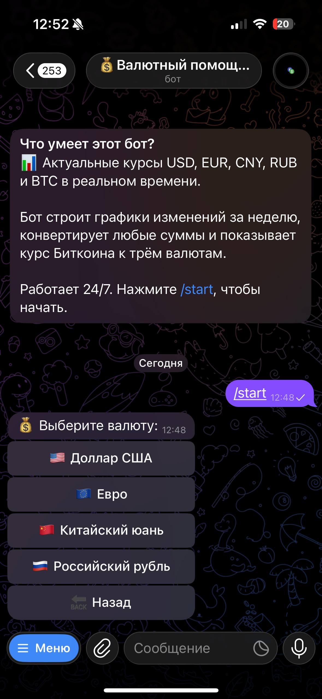
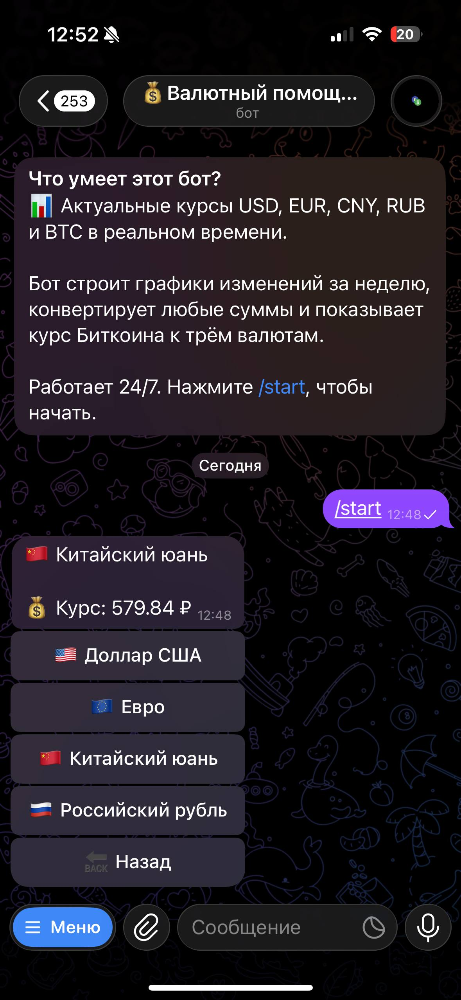
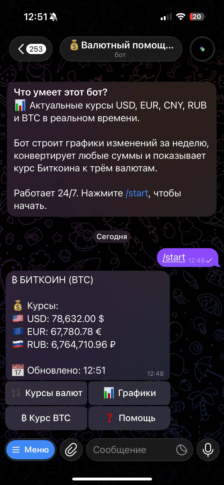
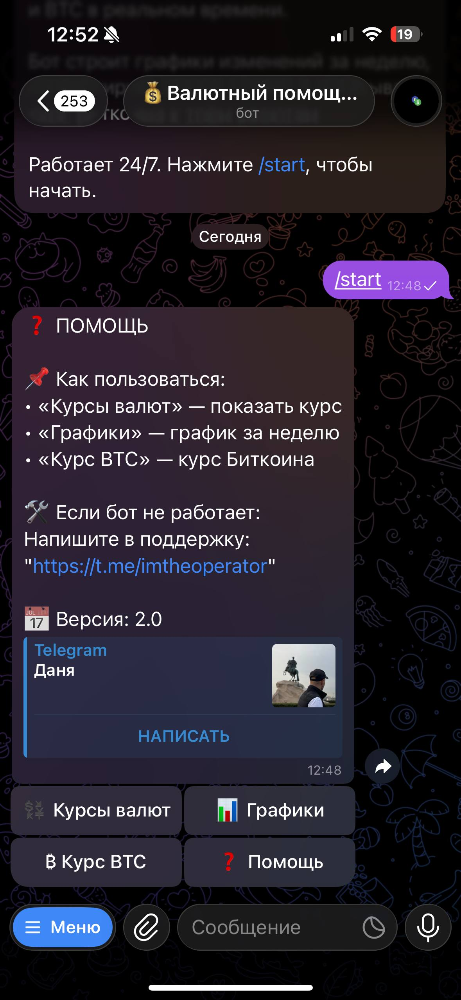
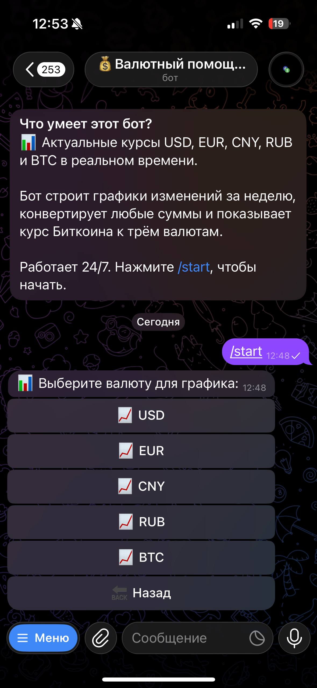
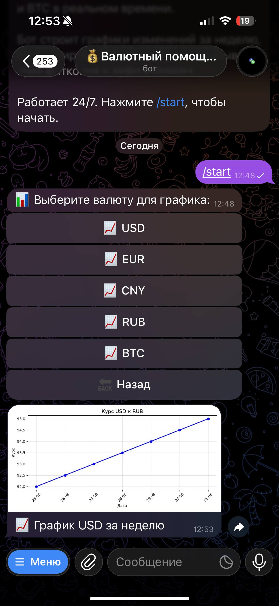

# 💰 Валютный помощник — Telegram-бот

Telegram-бот для отслеживания курсов валют и Биткоина.  
Проект создан в рамках изучения Python и Telegram API.

---

## 📌 Возможности

- 💱 Курсы USD, EUR, CNY, RUB в реальном времени  
- ₿ Курс Биткоина к USD, EUR, RUB  
- 📊 Графики изменений за неделю  
- 🧮 Конвертер валют (например: `100 USD в RUB`)  
- ❓ Встроенная помощь

---

## 📸 Примеры работы

| Действие | Скриншот |
|----------|----------|
| 👋 Приветственное сообщение |  |
| 🏠 Главное меню |  |
| 💱 Меню выбора валюты |  |
| 🇨🇳 Курс китайского юаня (CNY) |  |
| ₿ Курс Биткоина (BTC) |  |
| ❓ Раздел помощи |  |
| 📈 Меню выбора валюты для графика |  |
| 📊 График курса USD за неделю |  |

---

## 🛠 Технологии

- **Python 3.14**  
- **pyTelegramBotAPI** — для работы с Telegram  
- **Matplotlib** — для графиков  
- **Requests** — для запросов к API  

---

## 🚀 Запуск проекта

```bash
# Установите зависимости
py -m pip install -r requirements.txt

# Запустите бота
py currency_bot.py
```

---

## 👤 Автор

**Данил Королёв**  

- Telegram: [@imtheoperator](https://t.me/imtheoperator)  
- GitHub: [Danil-Korolev-data](https://github.com/Danil-Korolev-data)
